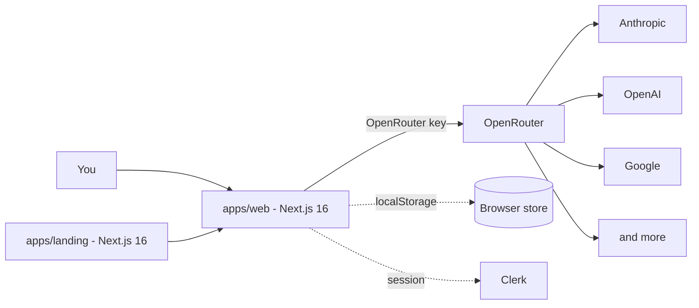

# prompttester

> Standalone LLM prompt tester. Run the same prompt across many models, see the outputs side by side, and compare token use and cost in one screen. Backed by OpenRouter.

**Live at [app.prompttester.io](https://app.prompttester.io).**

[](https://nextjs.org/)
[](https://www.typescriptlang.org/)
[](https://openrouter.ai/)
[](https://clerk.com/)
[](https://railway.app/)
[](#lineage)

**Archived.** The web app is still live, free to use, and signed in with Clerk. Code in this repo is the build behind that site.

---

## Table of contents

- [What this is](#what-this-is)
- [Tech stack](#tech-stack)
- [Architecture](#architecture)
- [Why no backend](#why-no-backend)
- [Repo layout](#repo-layout)
- [Build and run](#build-and-run)
- [Lineage](#lineage)
- [Sibling repos](#sibling-repos)

## What this is

Prompt Tester is a small tool for one workflow: write a prompt, pick a set of models, run them in parallel, and read the outputs in a grid.

Inputs and prompt versions are saved between runs. Each tweak is one click and one re-run. Every model card shows latency, token counts, and the per-call cost from OpenRouter. Test data lives in your browser (localStorage), not on a server.

The site is live at [app.prompttester.io](https://app.prompttester.io). Sign in is via Clerk.

## Tech stack

| Layer | Tools |
|---|---|
| Web | Next.js 16 (App Router) for `apps/web` and `apps/landing` |
| UI | React 19, Tailwind |
| Types | TypeScript 5, Zod schemas in `packages/types` |
| Auth | Clerk |
| Models | OpenRouter (one key fans out to OpenAI, Anthropic, Google, and more) |
| Storage | Browser localStorage (no DB) |
| Hosting | Railway, one service per app |
| Hygiene | ESLint 9 with `eslint-plugin-boundaries` for import zones, a pre-commit hook in `.githooks/` |

## Architecture



`apps/web` holds the tester UI and the Next.js API routes that talk to OpenRouter. `apps/landing` is the marketing site. `packages/types` holds the shared Zod schemas that both apps validate against at build time.

## Why no backend

The whole tool runs from the browser plus a thin Next.js API route. Sessions are gated by Clerk. Prompts and inputs live in localStorage on the user's machine. So nothing leaves the browser except the model call itself, which goes straight to OpenRouter.

That keeps the surface small and the privacy story simple: you bring the inputs, the tool runs them, and the results stay with you.

## Repo layout

```
apps/
  web/        # Next.js 16, the tester UI + API routes
  landing/    # Next.js 16, the marketing site
packages/
  types/      # Shared Zod + TS types, build-time gate
.githooks/    # Pre-commit hook for lint, types, boundaries
eslint.config.mjs
tsconfig.base.json
```

Import zones in each app (enforced by ESLint):

| Zone | Can import from | Cannot import from |
|---|---|---|
| `app/` | anything | - |
| `components/` | `lib/`, `types/` | `services/`, `app/` |
| `services/` | `lib/`, `types/` | `components/`, `app/` |
| `lib/` | `types/` | `components/`, `services/`, `app/` |
| `types/` | nothing | everything else |

## Build and run

```
npm install
npm run typecheck
npm run lint
npm run build
```

Per-app dev needs a Clerk and an OpenRouter key. Copy `.env.example` (per app) and fill in the values.

## Lineage

- Origin: `tartakovsky/prompttester` (private build)
- Archive: `tartakovsky-archive/prompttester` (this repo)
- Live site: [app.prompttester.io](https://app.prompttester.io)

## Sibling repos

Other public archives of the same author's work live in [tartakovsky-archive](https://github.com/tartakovsky-archive).
